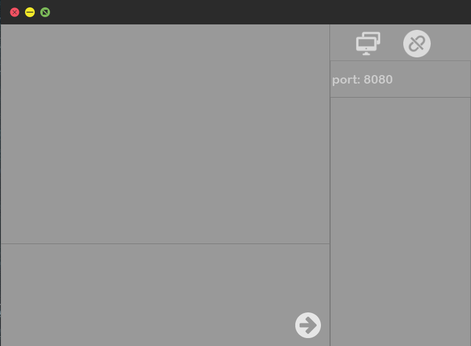
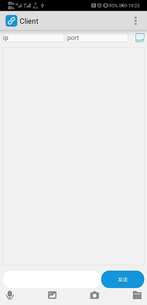

# 远程会议控制系统v1.1.0
## 开发环境
- Qt5.12
- Qt Creator4.8
- c++
## 运行环境
- Windows10
- Android手机

## 系统功能
- 服务器
    - 使用grabWindow()截取Windos全屏图片
    - 子线程使用TCP套接字实时发送截图给客户端实现投屏
    - 主线程接收子线程控制信息，调用Windows 鼠标事件API实现空屏幕效果
    -  [Window 鼠标事件API](https://docs.microsoft.com/zh-cn/windows/win32/api/winuser/nf-winuser-mouse_event) 
    - 使用UDP通信，与客户端互发消息

- 客户端
    - 子线程tcp套接字接收图片放到Label中显示实现视频的效果
    - 通过UDP通信实现聊天功能
    - Qt混合Android java代码打开手机相册显示在Label上
    - 代码参考 **[博客](https://amin-ahmadi.com/2015/12/08/how-to-open-android-image-gallery-in-qt/)**
    - 重写qt窗口事件，将事件通过tcp发送给服务器实现同步控制
    - 重写QT鼠标事件函数

    函数名 | 接口 | 
    ------------ | ------------
    鼠标按压事件 | void mousePressEvent(QMouseEvent *e)
    鼠标移动事件 | void mouseMoveEvent(QMouseEvent *e)
    鼠标释放事件 | void mouseReleaseEvent(QMouseEvent *e)
    鼠标双击事件 | void mouseDoubleClickEvent(QMouseEvent *e)

## 界面设计
### ServerUI

### ClientUI
 

## 项目调试
- 服务器配置
    - MinGW7.3.0编译器
    - Realse版调试
- 客户端调试
    - Android ARMv7
    - sdk16 
    - ndk28
- 在Qt Creator
---- 
## 总结
三天的项目实战，终于完成了我的第一个QT项目，事件有些急促，项目还有很多的不足之处。在项目中通过QT的TCP、UDP通信功能简单的实现了远程桌面的功能，加上聊天，仅仅只是完成了一小部分的功能。本次项目中存在很多的不足，如打开安卓相册的功能只能在安卓6.0左右的设备上运行。服务器的线程安全部分还有待修改。一些地方的内存可能没有释放或者错误释放。这些问题都会在某些时候导致程序崩溃。这些方面是我以后需要注意的地方，也是贯穿我C++学习的重点方面。

